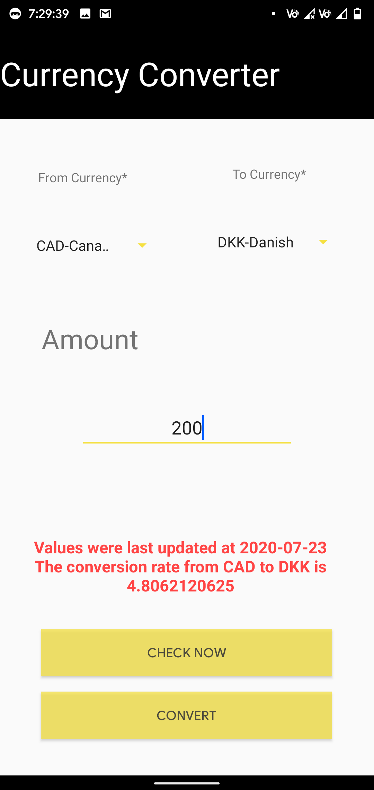
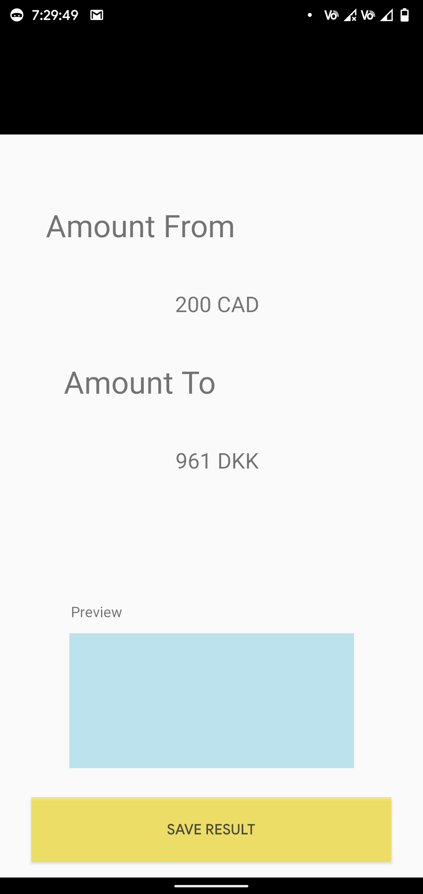

# CurrencyConverter
 Android App to Convert Currency Written in Java

## Sample Appfor the Peer Teaching Webinar at MIT ADT University

Features
- Supports upto 12 different currencies
- Checks rates through a live API
- Enables saving screenshots

### Sample Images

